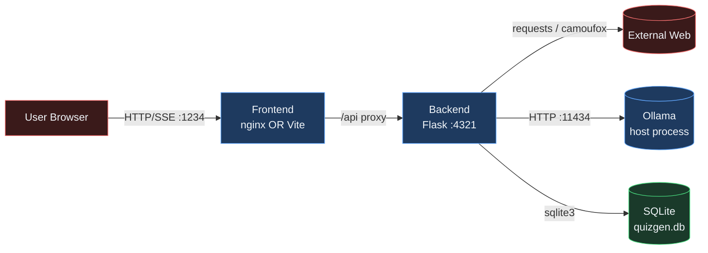
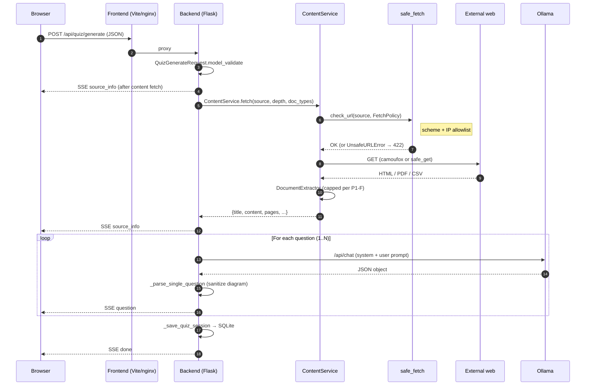
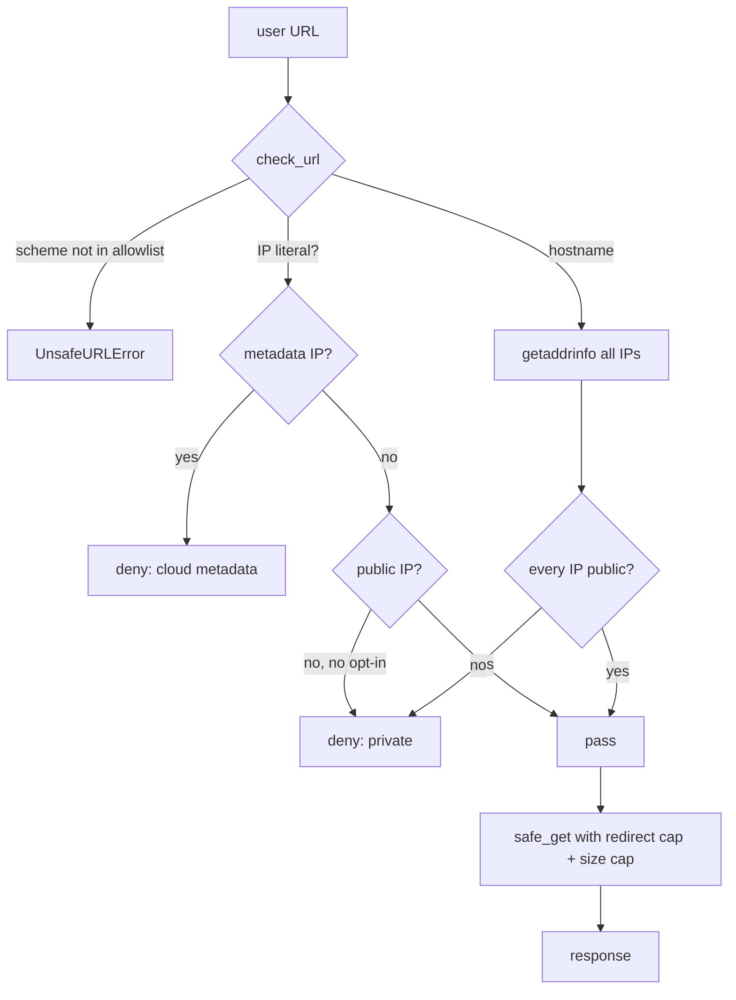
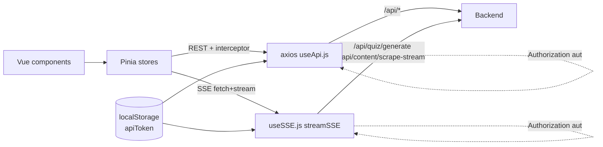
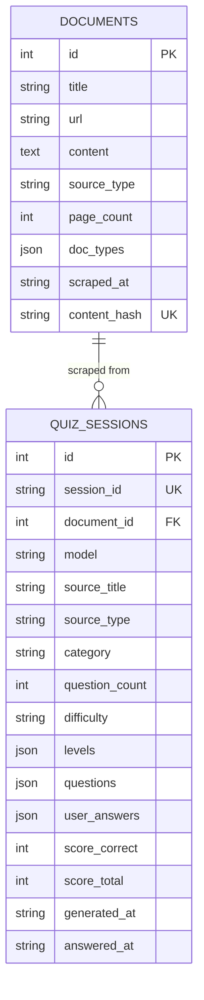

# Architecture

Snapshot taken **2026-04-15**, reflects the post-Phase-1 state on `main`.
Cross-referenced with [`SECURITY.md`](../SECURITY.md) (trust boundaries) and
[`docs/operations/runbook.md`](operations/runbook.md) (operational concerns).

---

## 1. Component map

| Component | Process / image                            | Trust | Notes                                                  |
|-----------|--------------------------------------------|-------|--------------------------------------------------------|
| Frontend  | `nginx:1.27-alpine` (prod) / Vite (dev)    | Trusted| Same-origin to user; proxies `/api` to backend         |
| Backend   | `python:3.11-slim` + Flask 3.1.3 + camoufox | Trusted| Runs as `appuser` (UID 1000) in prod, root in dev      |
| Ollama    | Host process (port 11434)                  | Trusted| Operator-owned; URL via `OLLAMA_BASE_URL`              |
| External web | Arbitrary HTTPS sites                   | Untrusted | Reached only via the safe_fetch policy (see §4)     |
| SQLite    | File in named volume `quiz-cache`          | Trusted | Holds documents + quiz_sessions; no PII intended    |

---

## 2. Endpoint inventory

Every route under `/api/`. Auth applies when `API_TOKEN` is set
(see [`SECURITY.md`](../SECURITY.md) §6).

| Verb | Path                                    | Body schema (Pydantic V2)            | Notes                                          |
|------|-----------------------------------------|--------------------------------------|------------------------------------------------|
| GET  | `/api/health`                           | —                                    | Auth-exempt; reports Ollama reachability       |
| GET  | `/api/system/specs`                     | —                                    | Host RAM/CPU hints                             |
| GET  | `/api/models`                           | —                                    | Lists Ollama-installed models                  |
| POST | `/api/content/preview`                  | `ContentRequest`                     | Returns title + first 600 chars                |
| POST | `/api/content/fetch`                    | `ContentRequest`                     | Returns full scraped content                   |
| GET  | `/api/content/scrape-stream`            | (query params → `ContentRequest`)    | SSE: `progress` × N, `done`, `error`           |
| POST | `/api/quiz/generate`                    | `QuizGenerateRequest`                | SSE: `source_info`, `progress`, `question` × N, `question_error`, `done`, `error` |
| GET  | `/api/documents`                        | —                                    | `?search=` substring filter                    |
| GET  | `/api/documents/by-url`                 | —                                    | Exact URL lookup                               |
| GET  | `/api/documents/<id>`                   | —                                    | Detail (incl. content)                         |
| GET  | `/api/documents/<id>/content-preview`   | —                                    | First 500 chars                                |
| POST | `/api/documents`                        | `DocumentCreateRequest`              | Creates; dedupes by content_hash               |
| DELETE | `/api/documents/<id>`                 | —                                    |                                                |
| GET  | `/api/results`                          | —                                    | `?document_id=` filter                         |
| GET  | `/api/results/categories`               | —                                    | Per-category aggregation                       |
| GET  | `/api/results/categories/breakdown`     | —                                    | Per-category × K1–K4 × difficulty × topic      |
| GET  | `/api/results/<session_id>`             | —                                    |                                                |
| POST | `/api/results/<session_id>/answers`     | `AnswersRequest`                     | Saves user answers + score                     |
| DELETE | `/api/results/<session_id>`           | —                                    |                                                |

Schemas live in `backend/app/api/_schemas.py`. Query-parameter parsing for the
non-body endpoints uses the helpers in `backend/app/api/_validation.py`.

---

## 3. Quiz generation flow

Implementation map:

| Step | File                                         | Function                          |
|------|----------------------------------------------|-----------------------------------|
| Validation        | `backend/app/api/_schemas.py`     | `QuizGenerateRequest`             |
| URL gate          | `backend/app/services/safe_fetch.py` | `check_url`, `safe_get`        |
| Scrape            | `backend/app/services/content_service.py` | `CamoufoxPlugin._fetch_with_*` |
| Extraction caps   | `backend/app/services/content_service.py` | `DocumentExtractor.*` (P1-F)   |
| LLM call          | `backend/app/services/quiz_service.py` | `generate_incremental`          |
| SSE write         | `backend/app/api/quiz.py`        | `event_stream`                     |
| Persistence       | `backend/app/api/quiz.py`        | `_save_quiz_session`               |
| SSE consume       | `frontend/src/composables/useSSE.js` | `streamSSE`                    |
| State store       | `frontend/src/stores/index.js`   | `useQuizStore.generate`            |

---

## 4. SSRF policy layering

Defaults (overridable per env var):

| Env var                 | Default | Effect when set                                   |
|-------------------------|---------|---------------------------------------------------|
| `ALLOW_HTTP`            | unset (https only) | Also allow `http://` URLs                |
| `ALLOW_PRIVATE_NETWORKS`| unset (public only) | Also allow RFC1918 / loopback / link-local |
| `MAX_FETCH_BYTES`       | 10 MiB  | Per-response body cap                             |
| `MAX_REDIRECTS`         | 3       | Per-request redirect cap                          |

Cloud metadata IPs (`169.254.169.254`, `100.100.100.200`, `fd00:ec2::254`)
are always denied even with `ALLOW_PRIVATE_NETWORKS=1`.

---

## 5. Frontend layer

Key files:

| Concern                 | File                                          |
|-------------------------|-----------------------------------------------|
| HTTP client + interceptor | `frontend/src/composables/useApi.js`        |
| SSE consumer (P1-G)     | `frontend/src/composables/useSSE.js`          |
| Stores (Pinia)          | `frontend/src/stores/index.js`                |
| Pages                   | `frontend/src/views/*.vue`                    |
| Mermaid render          | `frontend/src/components/QuestionCard.vue`    |
| Routes                  | `frontend/src/main.js`                        |

---

## 6. Persistence schema

Schema is created lazily by `backend/app/database.init_db()` on app startup;
the file lives at `DB_PATH` (env-aware default per P1-D — see
`backend/app/paths.py`).

WAL mode is enforced per connection. There is no migration framework yet:
schema changes must be additive (`ALTER TABLE`) and tolerate older clients.
A formal migration story (e.g. Alembic) is a future improvement.

---

## 7. Test layout

| Layer    | Tool       | Path                              | Count (2026-04-15) |
|----------|------------|-----------------------------------|--------------------|
| Backend unit | pytest | `backend/tests/test_safe_fetch.py` | 32 |
| Backend auth | pytest | `backend/tests/test_security.py`   | 10 |
| Backend extractor | pytest | `backend/tests/test_extractor_limits.py` | 9 |
| Backend schemas | pytest | `backend/tests/test_schemas.py`  | 21 |
| Frontend e2e | Playwright | `frontend/e2e/`                | 3 |

CI gates them all per push (see `.github/workflows/ci.yml`).
