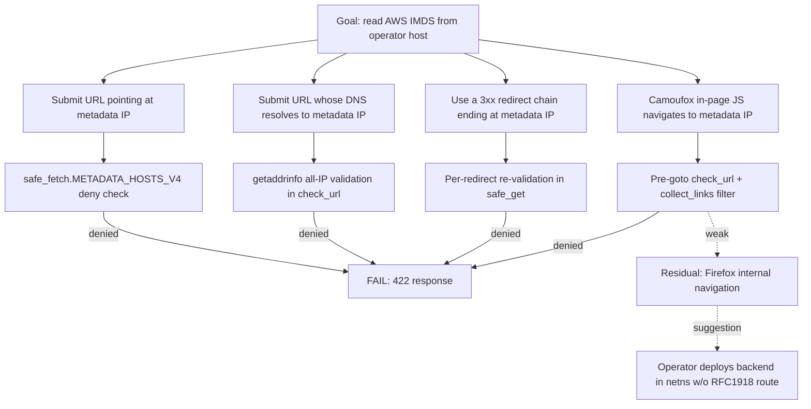

# Threat model

Method: lightweight STRIDE pass over the components and data flows
described in [`docs/architecture.md`](../architecture.md). Every entry
links back to the in-code mitigation (where one exists) or to a
follow-up ID. Audit findings start with `S-` for security and `M-` for
maintainability — the same IDs used by [`SECURITY.md`](../../SECURITY.md).

Last updated **2026-04-15** (post Phase 1 + P2-A/P2-B).

---

## 1. Assets, actors, trust boundaries

### Assets worth protecting

| ID  | Asset                              | Why it matters                               |
|-----|------------------------------------|----------------------------------------------|
| A1  | Quiz session history (SQLite)      | User-generated content; loss = wasted study time |
| A2  | Operator's scrape target list      | Reveals what the user is studying / interested in |
| A3  | Operator's local network           | Backend can reach RFC1918 if `ALLOW_PRIVATE_NETWORKS=1` |
| A4  | Cloud metadata (IMDS) on the host  | Theft = full credential compromise           |
| A5  | Ollama model weights / chat history | Local file IO; not network-exposed          |
| A6  | API_TOKEN secret (when set)        | Single shared bearer; opens every endpoint   |
| A7  | Browser cookies / localStorage     | Holds `apiToken`; XSS would exfiltrate it    |

### Actor model

| Actor                         | Capabilities                                       | Trust |
|-------------------------------|----------------------------------------------------|-------|
| Local user (Browser)          | Sends arbitrary URLs / text to backend             | Untrusted input source |
| Operator                      | Sets env vars, reads SQLite, restarts containers   | Trusted |
| Adjacent-network attacker     | Reaches `0.0.0.0:1234` and `:4321` from LAN        | Untrusted |
| External web site (scrape target) | Returns HTML/PDF/CSV; can attempt parser DoS or prompt-injection text | Untrusted |
| Ollama model                  | Generates JSON; output flows into UI               | Untrusted (LLM output is not authoritative) |
| Public-internet attacker      | Out of scope unless operator opens the port        | Out of scope |

### Trust boundaries (numbered to match diagrams)

```
TB-1: Browser ↔ Frontend (CORS allowlist + optional API_TOKEN)
TB-2: Frontend ↔ Backend (same-origin via nginx proxy, or Vite proxy in dev)
TB-3: Backend ↔ External web (safe_fetch policy + redirect cap)
TB-4: Backend ↔ Ollama (host-local HTTP, no auth)
TB-5: Backend ↔ SQLite (file IO; trusted)
TB-6: Browser ↔ localStorage (XSS surface for apiToken)
```

---

## 2. STRIDE summary by component

`✓ mitigated` = code or config in place. `△ partial` = mitigation exists
but documented residual risk. `✗ accepted` = consciously not addressed.
`→ planned` = follow-up tracked.

### 2.1 Frontend (Vue SPA)

| STRIDE | Risk                                                 | Status |
|--------|------------------------------------------------------|--------|
| S      | Phishing impersonation                               | ✗ accepted (operator decides hosting) |
| T      | Tampered LLM output rendered as HTML → XSS           | ✓ mitigated — `question`/`explanation`/`source_hint` use text interpolation; `diagram` flows through mermaid.js sanitize, mermaid version pinned in P0-9 |
| R      | Action repudiation                                   | ✗ accepted — single-user app, no audit trail |
| I      | apiToken exfiltrated by injected JS                  | △ partial — same-origin only, mermaid is the only third-party SVG path; CDN dynamic import dropped in P0-9 |
| D      | Infinite render loop / memory blowup from huge mermaid | △ partial — extractor caps upstream content (P1-F); mermaid itself unbounded |
| E      | Privilege escalation via SPA                         | N/A (SPA has no privileges) |

### 2.2 Backend (Flask)

| STRIDE | Risk                                                  | Status |
|--------|-------------------------------------------------------|--------|
| S      | Unauthorized request impersonating user               | △ partial — opt-in `API_TOKEN` (P1-A), unset by default for local-dev convenience |
| T      | Request body tampering                                | ✓ mitigated — Pydantic V2 schemas reject malformed JSON (P1-C) |
| R      | Server has no per-request audit log                   | → planned (Phase 3 logging redesign) |
| I      | Stack traces leaked to client                         | ✓ mitigated — generic 500 messages; full trace only in server log |
| I      | SSRF reads cloud metadata or LAN HTTP                 | ✓ mitigated — `safe_fetch` deny-by-default + always-deny metadata IPs (P0-4) |
| I      | Information leak via DNS rebinding                    | △ partial — every resolved IP validated, but TCP connect re-resolves (best-effort) |
| D      | Hostile PDF / CSV / HTML balloons memory              | ✓ mitigated — `DocumentExtractor` per-stage caps (P1-F) |
| D      | Crawl loop never terminates                           | ✓ mitigated — `MAX_PAGES_PER_RUN=50`, depth ≤ 8, BFS visited set |
| D      | Single client floods endpoints                        | ✗ accepted — no per-IP rate limiting (operator's reverse proxy responsibility) |
| E      | Privilege escalation in container                     | ✓ mitigated for prod backend (non-root `appuser`, P0-7); dev image stays root for bind-mount UX |

### 2.3 ContentService / scrape pipeline

| STRIDE | Risk                                                       | Status |
|--------|------------------------------------------------------------|--------|
| S      | User claims "I scraped X" but X was redirected to Y         | △ partial — pages list captures actual visited URLs; final IP not recorded |
| T      | Server cache poisoning (TTLCache key = URL+depth+doc_types) | ✓ mitigated — cache key includes all params; TTL 1h |
| I      | Scraped HTML contains internal URLs revealing infra         | ✗ accepted — operator's responsibility to not scrape internal docs |
| I      | Camoufox in-page JS pivots to internal network              | △ partial — pre-flight `check_url` rejects literal IPs and resolved hostnames; Firefox in-process navigation is best-effort |
| D      | Single deeply nested PDF reads ~minutes                     | ✓ mitigated — pypdf 6.10.1 (CVE-clean), pages capped at 20, per-page text capped at 50 KiB (P1-F) |
| E      | Code execution via crafted HTML triggering BeautifulSoup    | △ partial — lxml parser used; pinned 5.2.2 (no current CVE on parse path) |

### 2.4 LLM pipeline (Ollama)

| STRIDE | Risk                                                | Status |
|--------|-----------------------------------------------------|--------|
| T      | Prompt injection from scraped content steers LLM    | ✗ accepted (S-003) — no structural separator yet; planned for next pass |
| T      | LLM emits bogus question with `answer="z"`          | △ partial — `_parse_single_question` requires JSON object with `question` key, but no full schema check yet (`[PLANNED: S-013]`) |
| I      | LLM output exfiltrates secrets seen in prompt        | ✗ accepted — operator must not include secrets in scraped content |
| D      | Ollama hangs / takes minutes per question           | △ partial — connect 5s, read 120s; no retry budget across questions |
| E      | Ollama crashes the host                              | ✗ accepted (Ollama is operator-owned; see runbook for restart) |

### 2.5 Persistence (SQLite)

| STRIDE | Risk                                                | Status |
|--------|-----------------------------------------------------|--------|
| T      | Concurrent writes corrupt DB                        | ✓ mitigated — WAL mode; sqlite3 module is thread-safe per-connection |
| R      | "Who deleted this session?" — no audit row          | ✗ accepted (single-user) |
| I      | Volume mounted on shared host                       | ✗ accepted — operator's host security |
| D      | Disk fills from unbounded scraped content           | △ partial — per-document 1 MiB cap (P1-F); no global retention policy `[PLANNED: S-015]` |

---

## 3. Top risks (ranked by likelihood × impact, post Phase 1)

| Rank | ID    | Risk                                              | Likelihood | Impact | Mitigation status |
|------|-------|---------------------------------------------------|------------|--------|-------------------|
| 1    | S-003 | Prompt injection from scraped content             | High       | Medium | ✗ documented; structural defense planned |
| 2    | S-005 | API exposed to LAN with no auth (default)         | Medium     | High   | △ opt-in `API_TOKEN`; startup warning when bound non-loopback |
| 3    | S-002 | DNS rebinding race at TCP connect                 | Low        | High   | △ best-effort; SECURITY.md recommends netns isolation for high-value deployments |
| 4    | S-013 | LLM emits a malformed question silently saved     | Medium     | Low    | △ minimal type check; full schema planned |
| 5    | S-015 | SQLite grows unbounded                            | Medium     | Low    | △ per-doc cap; no auto-purge yet |
| 6    | -     | Concurrent crawls collide on TTLCache             | Low        | Low    | ✓ key isolation makes this benign |

---

## 4. Attack tree — "exfiltrate cloud metadata"

This is the single most damaging attack the product currently could
enable, so it gets its own decomposition.



All four branches converge on the same in-code denylist, which is
asserted by `backend/tests/test_safe_fetch.py`. Residual risk is
documented and pushed onto the operator via `SECURITY.md` §4.

---

## 5. Out of scope (intentional)

| Topic                                | Why out of scope                              |
|--------------------------------------|-----------------------------------------------|
| Multi-user authentication / RBAC     | Single-operator app; opt-in token is enough  |
| GDPR / CCPA data subject rights      | No PII collection by design                  |
| Federated logging / SIEM integration | Single-host deployment target                |
| WAF / DDoS protection                | Operator's reverse proxy responsibility      |
| Secrets vault                        | Token via env var; operator can layer in HashiCorp Vault / SOPS |

---

## 6. Review cadence

- Re-run this STRIDE pass after every "feature/" branch that touches:
  - `safe_fetch.py`, `security.py`, `_schemas.py`, or `content_service.py`
  - any new `/api/*` route
  - the SQLite schema
- Update the rank-ordered list in §3 after each pass.
- The runbook (`docs/operations/runbook.md` §6) lists the operational
  monitoring that flags when the threat model assumptions diverge from
  reality (e.g. unauthenticated access from a non-loopback IP).
